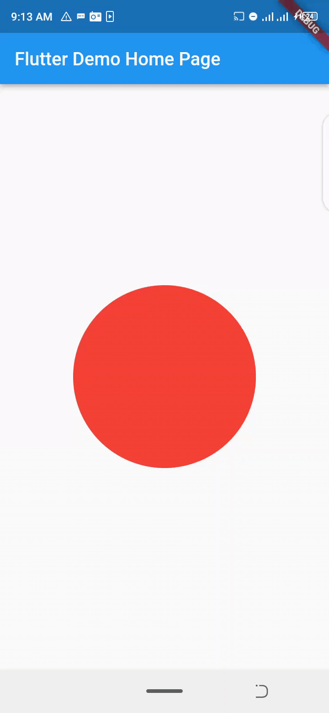
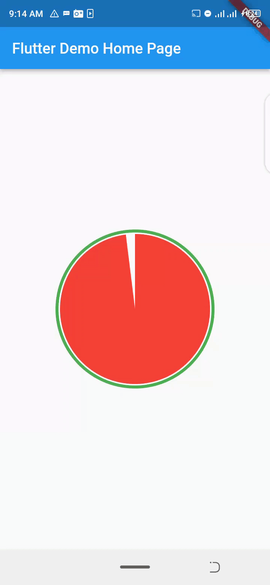

<!-- 
This README describes the package. If you publish this package to pub.dev,
this README's contents appear on the landing page for your package.

For information about how to write a good package README, see the guide for
[writing package pages](https://dart.dev/guides/libraries/writing-package-pages). 

For general information about developing packages, see the Dart guide for
[creating packages](https://dart.dev/guides/libraries/create-library-packages)
and the Flutter guide for
[developing packages and plugins](https://flutter.dev/developing-packages). 
-->
---
<h2>Circular Timer</h2>
<h3>This flutter package give a circular timer widget that is very easy to use and with a smooth animation</h3>
---


## Features
<h3>Light package that works this PLATFORM: ANDROID IOS LINUX MACOS WEB WINDOWS</h3>




## Getting started
<h4>TO install </h4>
<h5><kbd>flutter pub add circular_timer: ^1.0.1</kbd></h5>

## Usage


Basic usage

```dart
 CircularTimer(
    duration: const Duration(seconds: 30),
    radius: 100,
  ),
```

<h5>To change the default color, use the color property </h5>

 ```dart
  CircularTimer(
    duration: const Duration(seconds: 10),
    radius: 100,
    color: Colors.green,
  ),
```

<h5>To repeat the timer after the duration is completed set <i>repeat: true</i> the default value is false.</h5>

 ```dart
  CircularTimer(
    duration: const Duration(seconds: 10),
    radius: 100,
    color: Colors.green,
    repeat: true,
  ),
```

<h5>The startAngle is the position where it starts counting ` its value must be in radian`</h5>
<h6>startAngle default value is set to 
 <code> <i> 1.5 * math.pi</i></code>
</h6> 

  


<h5>To form a ring around the circular timer:</h5>
<h6>you have to set  <code> <i> outline: true</i></code></h6>
<h6> the ring width can change by setting the <code> <i> outlinedWidth</i></code> to a nonNegative value </h6>

<h4><code>OutlinedPadding</code> is the distance between the ring and the circular timer and can be set to zero to form a border. The default <code>outlinedPadding</code> value is <code>4.0</code></h4>

 ```dart
  CircularTimer(
    duration: const Duration(seconds: 10),
    radius: 100,
    color: Colors.green,
    repeat: true,
    outline: true,
    outlinedPadding: 0.0
    outlinedWidth: 3.0
  ),
```

<h4>CircularTimer has a <code>decoration</code>property that allow you the rewrite the default <code>outlinedColor </code> that is the ring color`</h4>

```dart 
   CircularTimer(
    duration: const Duration(seconds: 10),
    radius: 100,
    color: Colors.green,
    decoration: CircleDecoration(
      outlinedColor: Colors.green
    )
  ),
```
<h5>you can rewrite the <code>outlinestyle</code> and <code>circleStyle</code> inside the CircleDecoration</h5>

## Additional information

<h4>To contribute to this package</h4>
https://github.com/morka17/circular_timer

<h4>To file any issues </h4>
https://github.com/morka17/circular_timer/issues
